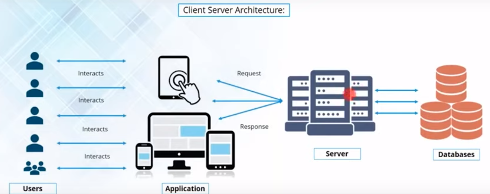
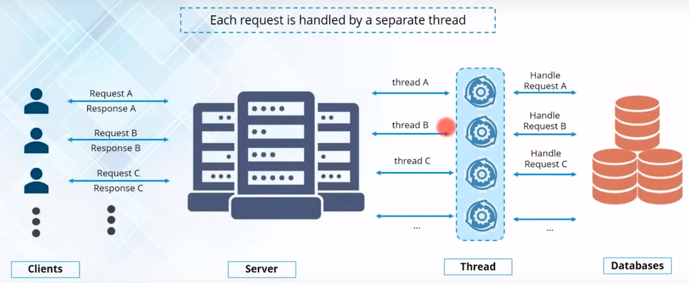
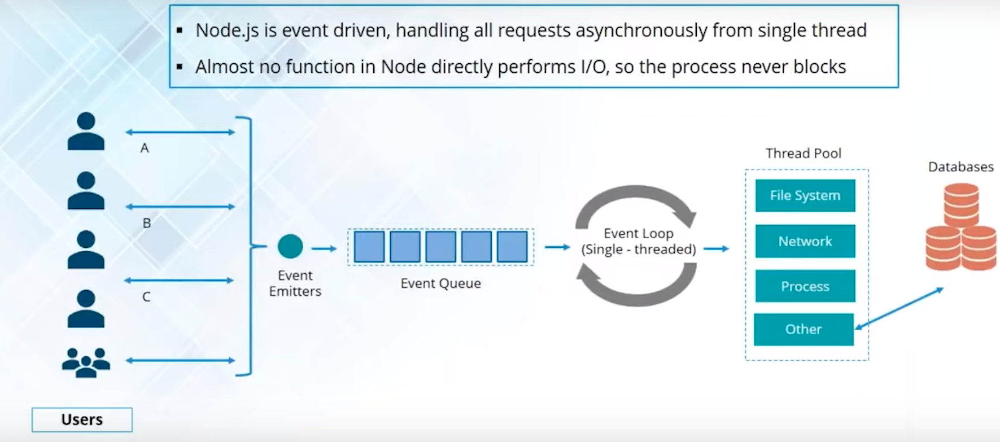
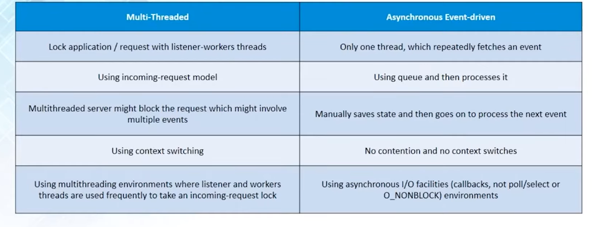
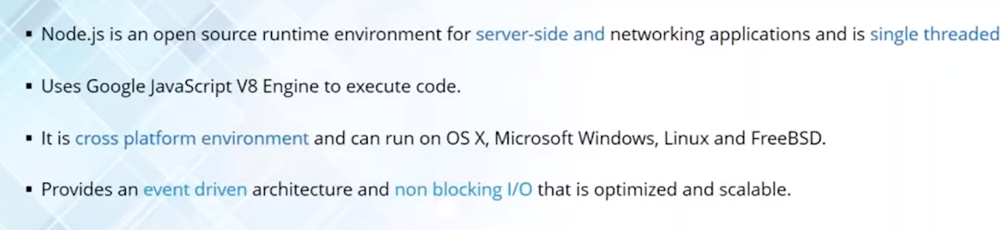
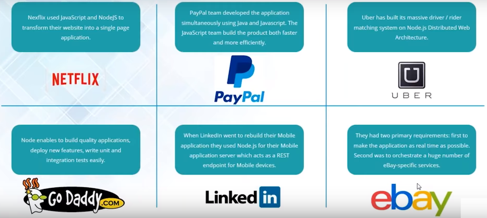
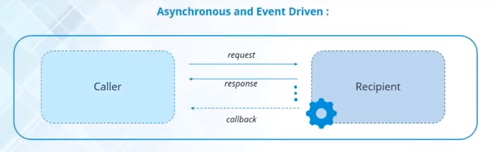
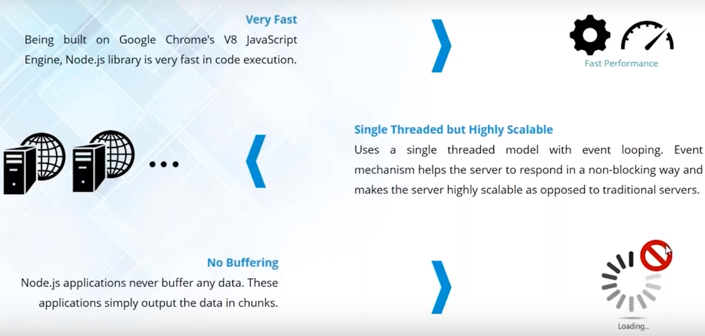
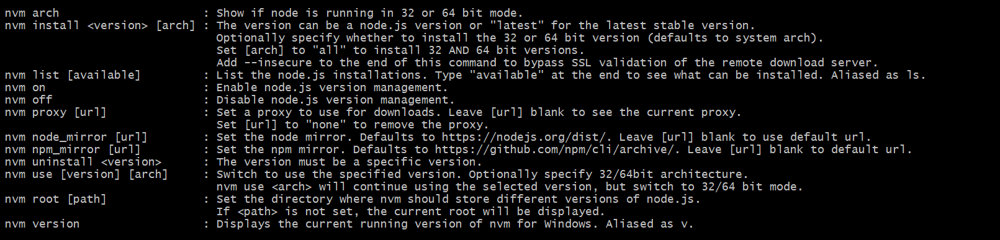

# Basics Concepts and Installation

## JavaScript Basics
* JavaScript is a programming language that adds interactivity to your website (for example games, responses when buttons are pressed or data is entered in forms, dynamic styling, and  animation). 
 * JavaScript (JS) is a lightweight, interpreted, or just-in-time compiled programming language with first-class functions. 
* While it is most well-known as the scripting language for Web pages, many non-browser environments also use it, such as Node.js, Apache CouchDB and Adobe Acrobat. 
* JavaScript is a prototype-based, multi-paradigm, single-threaded, dynamic language, supporting object-oriented, imperative, and declarative (e.g. functional programming) styles.

## Create a simple button click event to change context

## Variables
var x = 10
* Data Types
    - String
    - Number
    - Boolean
    - Array
    - Object
## Comments
    /*
    I am from Vibranium brigade and We are a BRAND.
    We are galvanites
    */

    // I am from Vibranium brigade and we are a BRAND
    // We are galvanites
## Functions
    function name(parameter1, parameter2, parameter3) {
    // code to be executed
    }

## Objects
    var employee = {
    name: "John",  
    age: 50,  
    };
    employee.name

## Arrays
    var cars = new Array("Saab", "Volvo", "BMW");
    var cars = [
        "Saab",
        "Volvo",
        "BMW"
        ];
pop/shift   : Pop returns the value popped out/ Removes first element
push/unshift : Adds to last /first resp

## Switch case or If else

## typeof
    typeof "Vibranium"                 // Returns "string"
    typeof 3.14                   // Returns "number"
    typeof NaN                    // Returns "number"
    typeof false                  // Returns "boolean"
    typeof [1,2,3,4]              // Returns "object"
    typeof {name:'Biswa', age:27}  // Returns "object"
    typeof new Date()             // Returns "object"
    typeof function () {}         // Returns "function"
    typeof biswa                  // Returns "undefined" *
    typeof null                   // Returns "object"

## Performance JS
    * Reduce Activity in Loops. 
    * Reduce DOM Access/Size (Keep the number of elements in the HTML DOM small.)
    * Avoid Unnecessary Variables

## ES5 vs ES6
### ES5
    The "use strict" Directive
    String.trim()
    Array.isArray()
    Array.forEach()
    Array.map()
    Array.filter()
    Array.reduce()
    Array.reduceRight()
    Array.every()
    Array.some()
    Array.indexOf()
    Array.lastIndexOf()
    JSON.parse()
    JSON.stringify()
    Date.now()
    Property Getters and Setters
    New Object Property Methods

### ES6
    JavaScript let
    JavaScript const
    JavaScript Arrow Functions
    JavaScript Classes
    Default parameter values
    Array.find()
    Array.findIndex()
    Exponentiation (**) (EcmaScript 2016)
    
## Client Server Architecture

## MultiThread Model
_Each request is handled by a separate thread_

* User generates a request while intacting with the application and sends to the server.
* Server maps a new thread from the thread pool and thread becomes responsible to read the request and send the response.
* No. of request = No of used threads from the thread pool.
* 1 Scenario or limitation:
    * Millions requests coming in pers sec and limited threads. Thread exhausation might occur.
    * Lead to scalability and solved by adding multiple resources
* 2 Scenario or limitation:
    * Shared resource issue(acquires a lock) which leads to slow response time and bottleneck for the server.(blocks other threads)
    

## SingleThread Model

* When a activity/new request is performed, a event is generated. E.g. Click a button.
* Once a event is generated, event emitter emit those events and events reside in event queue in the server.
* Events are executed using event loops(Single Thread Mechanism)
* A single thread takes event from the event queue and allocated event to a worker thread inside the thread pool.
* Allocation is based on operation performed by event. e.g. i/o worker thread
* worker thread will process these events asynchronously.
* 1 thread in the event will be handling the events directly.
* So, No function in node js can perform a action directly so process never gets blocked.
 Event driven model. Node js follows this

## Summary on Multi Thread vs Single Thread
    

## What is Node JS?

## Who all uses Node JS?

* Well suited for distributed systems that make a lot of network requests.
* Active open source community.
## Asynchronous and Event Driven

* When request is sent to server, Server doesnt waits to process the request rather it continues to process other requests. Request processing completes, response is sent back to caller func via callback mechanism.

## Blocking and Non-blocking
    A restaurant food order system. 
    -- will cover practival in file stream section.
## Node js features

## Node js installation
https://nodejs.org/en/download/

## nvm 
Node Version Manager -- created typically for linux but post v10, it came with windows also.
https://github.com/coreybutler/nvm-windows

### nvm commands

