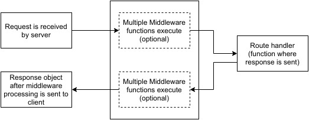
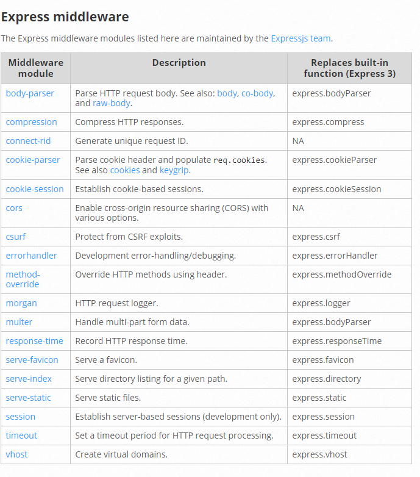

# Express
Fast, unopinionated, minimalist web framework for Node.js
       
        npm install express

### app.get(route, callback)
### res.send()
### app.listen(port, [host], [backlog], [callback]])
    port

        A port number on which the server should accept incoming requests.

    host

        Name of the domain. You need to set it when you deploy your apps to the cloud.

    backlog

        The maximum number of queued pending connections. The default is 511.

    callback

        An asynchronous function that is called when the server starts listening for requests.

Demo(server.js)

### app.method(path, handler)

    Path
        route at which the request will run.

    Handler 
        callback function that executes when a matching request type is found on the relevant route.

Demo (appmethods/appmethods.js)

### app.all

Demo (appmethods/appall.js)

### Routers
    Helps in maintaining code.

Demo(routersExample)

(dynamicroutes)
### HTTP Methods
    GET
    PUT
    POST
    DELETE

### URL Building
Till now, we defined routes but those are fixed or static.

<i>What about dynamic routes?</i>

<i>pattern matched routes</i>

### Middlewares
Functions that have access to 

        request object (req)

        response object (res)

        next middleware function in the application’s request-response cycle

#### Demo -- Simple time logger for all requests 
(middlewares/app.js)

#### Demo -- Simple time logger for specific route request
(middlewares/specificroutemiddlewares.js)

### Third Party middlewares

## Post Request Handling
Demo : postrequest/server.js

## Static Files
Demo: staticfiles/

## Scaffolding
    Scaffolding is creating the skeleton structure of application.
    It allows users to create own public directories, routes, views etc. Once the structure for app is built, user can start building it.
    
    npm install express-generator -g 

## Debugging
https://code.visualstudio.com/docs/editor/debugging

## Exception Handling
