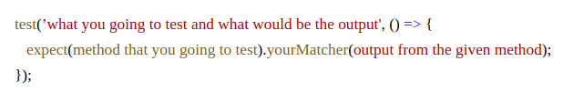

## How to write a unit test case in node js
Lot of libraries like below:
Mocha
Chai
Enzyme
AVA
Jasmine
Jest

## Galvanize uses <i>Jest</i>
## Why?
Fast framework
Simple configuration
Easy to use
Snapshot testing
In-built Mocks and spies
In-built Coverage reports
Comes with an assertion library
Runs tests in parallel processes
Promise support
Open source
Comes with wide APIs

