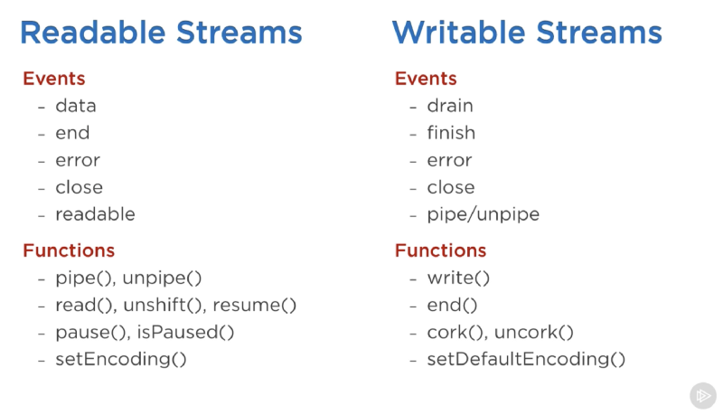

## Streams
        Streams are collections of data — just like arrays or strings. 

        Many built in node js modules implement the streaming interface.
        Streams are objects that let you read data from a source or write data to a destination in continuous fashion. In Node.js, there are four types of streams −

Example:

    A HTTP response is readable stream on client but writable on server.

    We read from http.IncomingMessage
    We write to other using http.ServerResponse

### Types of Streams
    1.  Readable
    2.  Writable
    3.  Duplex
    4.  Transform

### Stream Events 

## How to read from a stream

## How to write to a stream

## Piping of Streams
     provide the output of one stream as the input to another stream
